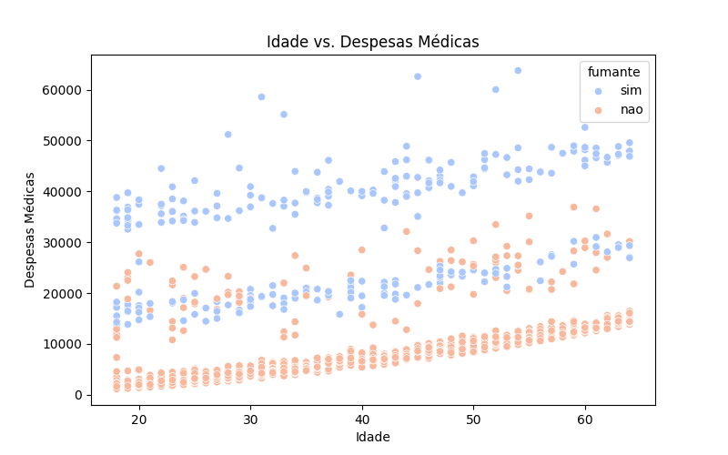
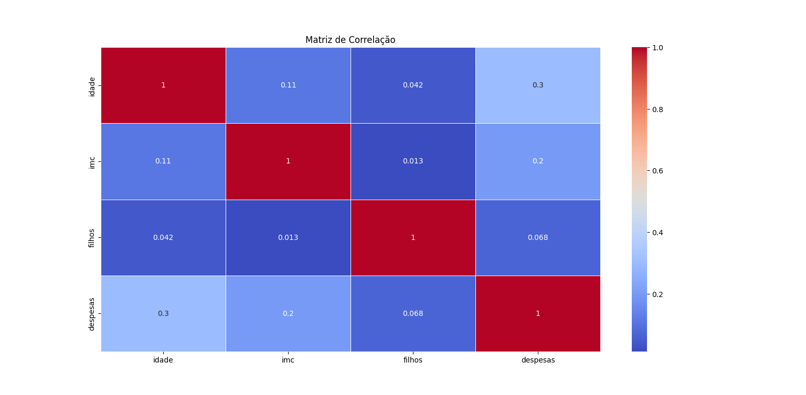

# Client-livestyle-Insights

## Visão Geral
Este projeto utiliza Python para analisar e visualizar dados de saúde e despesas médicas de clientes de seguro de vida. Através do uso das bibliotecas pandas, seaborn e matplotlib, o projeto transforma dados brutos de um relatório em CSV em visualizações poderosas e intuitivas

## Graficos e Insights
**Histograma em despesa:** Apresenta a maior parte da pessoas tem uma despesa em torno de 5.000, existindo também valores a mostra de 60.000 como Outlier.

**Historgrama de idade:** Mostra a maior parte dos clientes possui uma faixa etária de 15 a 20 anos.

**Box-plot IMC:** Por Status de fumante, apresenta diversos outlier de não fumantes.

**Entre Idade e Despesas Médicas em gráfico de Dispersão:** Conclui-se uma correlação positiva nas despesas sendo elevada ao passar da idade e que os fumantes tem uma despesas ainda maior.

**Blox-plot de despesas medicas entre fumantes e não fumantes:** Trás a evidencia que o fumante tem um gasto maior em despesas e no seu terceiro quadrante do indicador, acima da mediana um valor 40.000.

**Matriz entre variáveis quantitativas:** Agregam em analises para correlações positivas na quantidade de filhos por despesas e idade por IMC.
